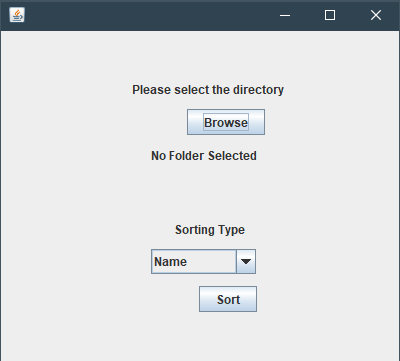

# File-Organizer
This program will scan through a folder of random files (.docx, .mp3, .mp4, .txt, .png, .gif, etc.) and sort these files into different folders based on the user’s choice (size, modified date, name, type of file, etc.)

## Requirements
* Windows
* NetBeans or any Java IDE
* The folder desired to be sorted must only have files in it (no additional folders in the folder)
* User must create a empty folder called "testResult" on their desktop

## Instructions
Simply open the "File-Organizer" project in NetBeans or other Java IDE and hit run.

## Sorting Options
1. Name
   - Sort the folder by the name of the files (0-9, A-G, H-N, O-T, U-Z)
2. Size
   - Sort the folder by the sizes of the files (four folders from the smallest size to the biggest)
3. Modified Date
   - Sort the folder by the latest modified date of the file (Month/Year) 
4. Type
   - Sort the folder by the type of the files (.exe, .txt, .jpg, .pdf, etc.)

## Screenshots

## Built With
* Java

## Author(s)
* Kevin Huang
